# LR6 #
Лабораторная работа №6

# Шаги выполнения #

1.	**Настройка клиент git**

	Вводим имя пользователя - "4918 Евдокимова Д.А." и email - dasha.eudokimova@yandex.ru
	
    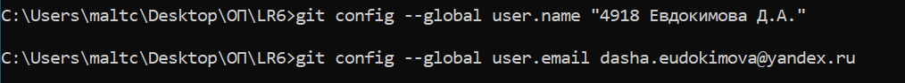

2.	**Клонирование удалённого репозитория на компьютер**

	Клонируем рупазиторий на рабочий стол компьютера.
	
    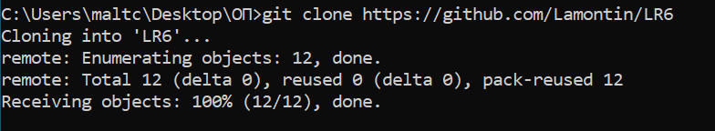
    
3.	**Добавление файла через интерфейс GitHub**

	Добавляем файл myFile.txt через интерфейс GitHub. Подтягиваем изменения в локальный репозиторий.
	
    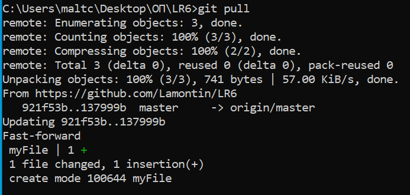

4.	**Получение всей истории операций**

	 Получаем историю всех операций для каждой из веток.
	 
    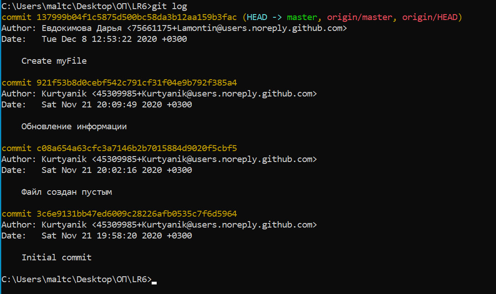

5.	**Получение последних изменениий**

	Получаем историю последних двух операций для каждой из веток.
	
    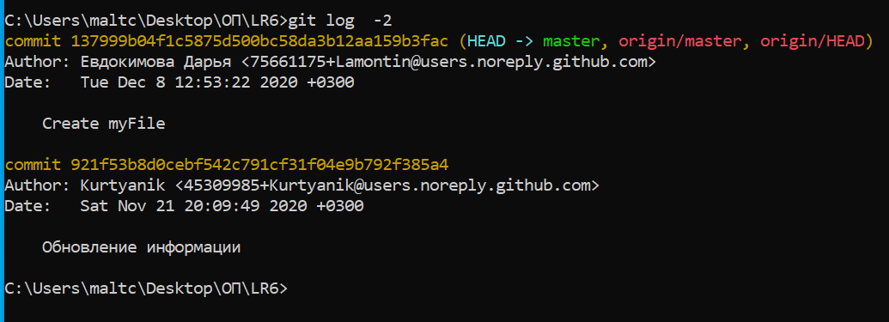

6.	**Слияние в ветку master**

	Выполняем слияние ветки branch1 в ветку master, разрешив конфликт c помощью графического интерфейса git.
	
    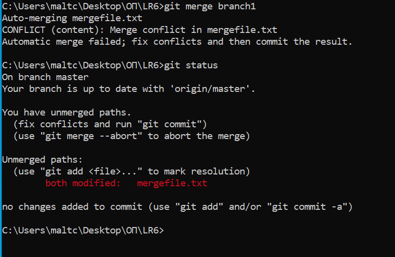 
    
    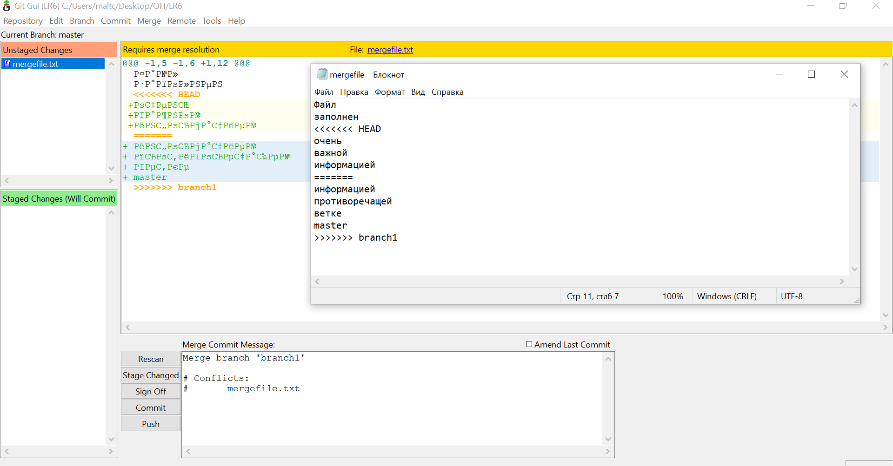
    
    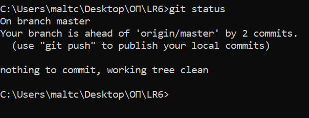  

7.	**Удаление побочной ветки**

	Удаляем побочную ветку после успешного слияния.
	
    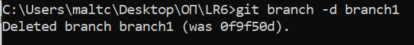  

8.	**Фиксирование изменений**

	Делаем изменения в файле myFile= и зафиксируем их, оставляя комментарии два раза.
	
    
    
    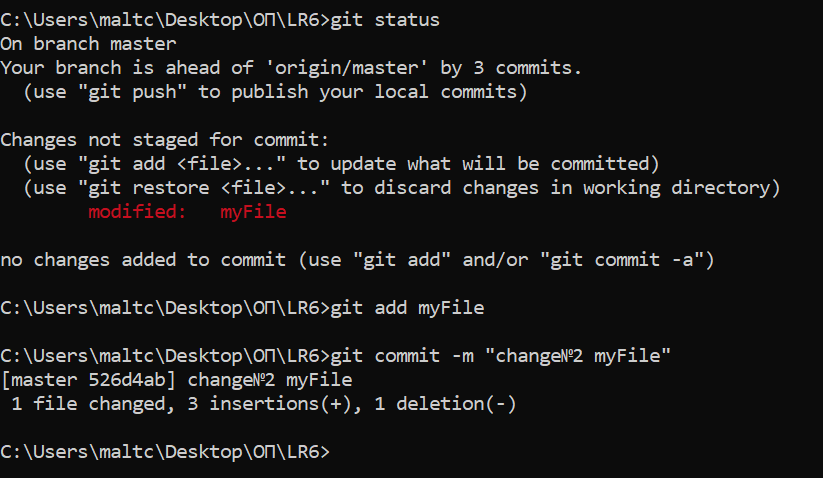
    
9.	**Откат коммита**

	Делаем «хард» откат коммита.
	
    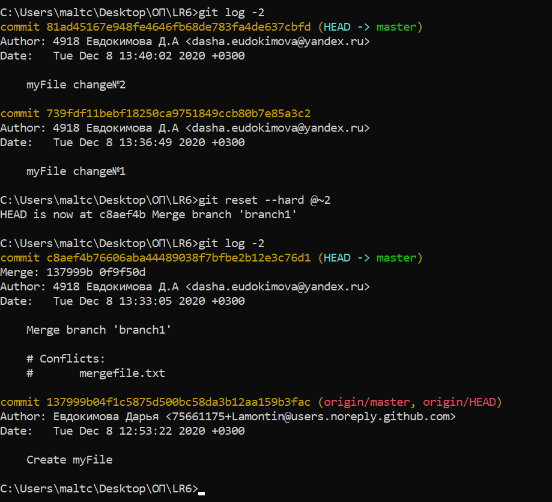 

10.	**Создание ветки**

    Создаем ветку report для отчёта.
    
    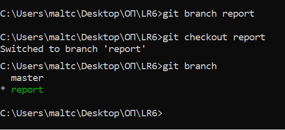 

# Лог команд  #

```sh

> git config --global user.name "4918 Евдокимова Д.А."
> git config --global user.email dasha.eudokimova@yandex.ru
> git clone https://github.com/Lamontin/LR6
> git pull      				
> git log    					 
> git log -2 					
> git merge branch1				
> git branch -d branch1 		       
> git add myFile  	                       
> git commit -m "change№1 myFile"   
> git add myFile                        
> git commit -m "change№2 myFile"   
> git reset --hard @~2			     
> git branch report 			       
> git checkout report
  
```
# История операций #

Хеш: 392365e Дата: Tue Dec 8 14:11:28 2020 +0300 Имя: 4918 Евдокимова Д.А Коментарий: README изменение(добавление Лога команд)
Хеш: c4f2eca Дата: Tue Dec 8 14:06:30 2020 +0300 Имя: 4918 Евдокимова Д.А Коментарий: README изменение(добавление Шагов выполнения)
Хеш: 5f25a35 Дата: Tue Dec 8 13:52:20 2020 +0300 Имя: 4918 Евдокимова Д.А Коментарий: Добавление скриншотов
Хеш: c8aef4b Дата: Tue Dec 8 13:33:05 2020 +0300 Имя: 4918 Евдокимова Д.А Коментарий: Merge branch 'branch1'
Хеш: 137999b Дата: Tue Dec 8 12:53:22 2020 +0300 Имя: Евдокимова Дарья Коментарий: Create myFile
Хеш: 921f53b Дата: Sat Nov 21 20:09:49 2020 +0300 Имя: Kurtyanik Коментарий: Обновление информации
Хеш: 0f9f50d Дата: Sat Nov 21 20:08:33 2020 +0300 Имя: Kurtyanik Коментарий: Заполнил файл
Хеш: c08a654 Дата: Sat Nov 21 20:02:16 2020 +0300 Имя: Kurtyanik Коментарий: Файл создан пустым
Хеш: 3c6e913 Дата: Sat Nov 21 19:58:20 2020 +0300 Имя: Kurtyanik Коментарий: Initial commit


