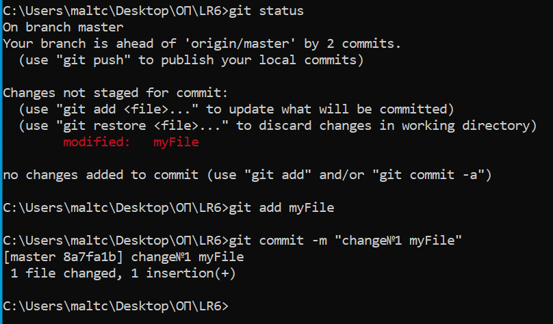

# LR6 #
Лабораторная работа №6

# Шаги выполнения #
1.	**Настройка клиент git**
	Вводим имя пользователя - "4918 Евдокимова Д.А." и email - dasha.eudokimova@yandex.ru
    

2.	**Клонирование удалённого репозитория на компьютер**
	Клонируем рупазиторий на рабочий стол компьютера.
    
    
3.	**Добавление файла через интерфейс GitHub**
	Добавляем файл myFile.txt через интерфейс GitHub. Подтягиваем изменения в локальный репозиторий.
    

4.	**Получение всей истории операций**
	 Получаем историю всех операций для каждой из веток.
    

5.	**Получение последних изменениий**
	Получаем историю последних двух операций для каждой из веток.
    

6.	**Слияние в ветку master**
	Выполняем слияние ветки branch1 в ветку master, разрешив конфликт c помощью графического интерфейса git.
      
     
      

7.	**Удаление побочной ветки**
	Удаляем побочную ветку после успешного слияния.
      

8.	**Фиксирование изменений**
	Делаем изменения в файле myFile= и зафиксируем их, оставляя комментарии два раза.
    
    
    
9.	**Откат коммита**
	Делаем «хард» откат коммита. 
     

10.	**Создание ветки**
    Создаем ветку report для отчёта.
     
    